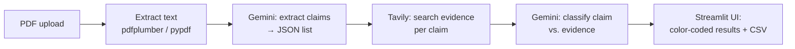

# Truth Layer

A "Truth Layer" agent for marketing content. Upload a PDF, and it extracts
every checkable factual claim, verifies each one against live web evidence,
and flags what's false or outdated — stating the current correct figure
where one exists, not just a red flag.

**Live app:** _add your Streamlit Cloud URL here once deployed_

## What it does

1. You upload a marketing PDF.
2. Gemini reads the extracted text and pulls out checkable claims (stats,
   dates, market figures, named comparisons) — skipping vague opinion
   language with nothing concrete to verify.
3. For each claim, Tavily runs a live web search and returns clean,
   LLM-ready evidence snippets.
4. Gemini compares the claim against that evidence and classifies it as
   **True**, **False**, **Outdated**, or **Unverifiable** — and where the
   claim is wrong or stale, states the current correct fact pulled from the
   evidence.
5. Results render as a color-coded list with sources, plus a CSV export.

## Architecture



Gray boxes are local code; the two Gemini calls are the core of the design —
one turns messy PDF text into structured claims, the other turns a claim +
live evidence into a verdict plus the corrected fact.

## Why this stack, on zero budget

- **Streamlit + Streamlit Community Cloud** — free hosting with a shareable
  URL, deploys directly from GitHub, and needs almost no frontend code,
  which matters most when time is the binding constraint.
- **Gemini API (`gemini-2.5-flash`)** — genuinely free tier, no card
  required, and Flash's free-tier request allowance is high enough to run
  a full document through without burning quota mid-demo. A Flash-Lite
  fallback is exposed in the sidebar in case of rate limits.
- **Tavily Search API** — 1,000 free credits/month, no card, and returns
  pre-cleaned snippets built for feeding straight into an LLM prompt rather
  than raw HTML to scrape and parse.

## Known limitations

- Free-tier rate limits mean a document with many claims (>15-20) can be
  slow; the sidebar slider caps how many claims are processed per run.
- If Tavily returns zero results for a claim, the app flags it as **False
  — no evidence found** by design, rather than guessing or crashing. This
  is a deliberate fail-loud choice: an unverifiable claim in marketing
  content is itself worth flagging.
- Scanned/image-only PDFs without a text layer aren't supported (no OCR
  step yet).
- Classification quality depends on Gemini's judgment; it's a strong first
  pass, not a guarantee — this is a triage tool, not a final arbiter.

## What I'd add with more time

- An OCR fallback (e.g. pytesseract) for scanned PDFs.
- Caching evidence lookups so re-running the same document doesn't re-spend
  Tavily credits.
- A confidence score per claim, not just a category, so a human reviewer
  knows where to focus first.
- Batch mode for checking multiple documents and tracking which sources
  for a brand drift out of date most often over time.

## Running locally

```bash
pip install -r requirements.txt
cp .streamlit/secrets.toml.example .streamlit/secrets.toml
# edit secrets.toml with your real keys
streamlit run app.py
```

## Deploying on Streamlit Community Cloud

1. Push this folder to a GitHub repo.
2. On share.streamlit.io, create a new app pointed at that repo and `app.py`.
3. In the app's Settings → Secrets, paste the contents of
   `.streamlit/secrets.toml.example` with your real keys filled in.
4. Deploy, then test the live URL with a PDF you didn't develop against.
